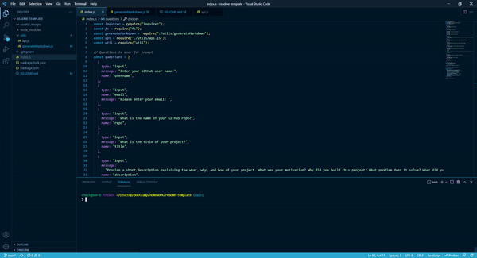

# readme-template

Repo: https://github.com/curriecoder/readme-template

## Description

This project was motivated by a desire to use command line interface to generate a professional README.md by answering prompts in the terminal. I learned how to install npm packages and create a program in node.js with ES6 as well as gather user data to create the readme.

## Usage

Instructions: Install inquirer and axios with npm. Be sure to npm init and require 'fs' as well as 'util' to have this application work correctly.  

  

## Credits

I would first like to thank the instructors of UPenn LPS Coding Bootcamp class of 08-2021 for continually putting the students at the top of the importance list. Also, thanks to all of my classmates that helped me rubber duck my way through this project. Big thanks to all of GitHub for blazing the trail.

## License

MIT License

Copyright (c) [2021] [Andrew J. Currie]

Permission is hereby granted, free of charge, to any person obtaining a copy
of this software and associated documentation files (the "Software"), to deal
in the Software without restriction, including without limitation the rights
to use, copy, modify, merge, publish, distribute, sublicense, and/or sell
copies of the Software, and to permit persons to whom the Software is
furnished to do so, subject to the following conditions:

The above copyright notice and this permission notice shall be included in all
copies or substantial portions of the Software.

THE SOFTWARE IS PROVIDED "AS IS", WITHOUT WARRANTY OF ANY KIND, EXPRESS OR
IMPLIED, INCLUDING BUT NOT LIMITED TO THE WARRANTIES OF MERCHANTABILITY,
FITNESS FOR A PARTICULAR PURPOSE AND NONINFRINGEMENT. IN NO EVENT SHALL THE
AUTHORS OR COPYRIGHT HOLDERS BE LIABLE FOR ANY CLAIM, DAMAGES OR OTHER
LIABILITY, WHETHER IN AN ACTION OF CONTRACT, TORT OR OTHERWISE, ARISING FROM,
OUT OF OR IN CONNECTION WITH THE SOFTWARE OR THE USE OR OTHER DEALINGS IN THE
SOFTWARE.

-------------------------------------------------------------